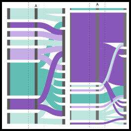
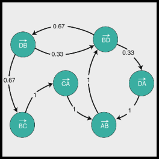
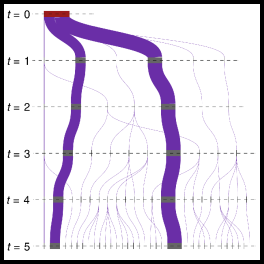
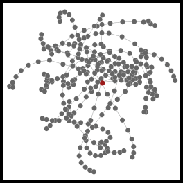
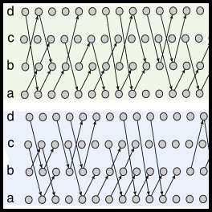
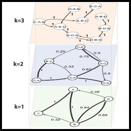

pathpy: path data analysis
==========================

--------------------------------------

An OpenSource python package for the analysis of time series data on networks
using higher-order and multi-order graphical models.

Documentation
-------------

Online documentation is available at [pathpy.net](https://www.pathpy.net).

The docs include a [tutorial](https://www.pathpy.net/tutorial.html), [example gallery](https://www.pathpy.net/examples/index.html), [API reference](https://www.pathpy.net/api.html), and other useful information.

Dependencies
------------

Pathpy supports Python 3.7+.

Installation requires [numpy](http://www.numpy.org/) and [scipy](https://www.scipy.org/).
<!-- Some functions will optionally use [statsmodels](https://www.statsmodels.org/) if it is installed.  -->

Installation
------------

The latest stable release (and older versions) can be installed from PyPI:

    pip install pathpy

You may instead want to use the development version from Github:

    pip install git+https://github.com/pathpy/pathpy.git#egg=pathpy

Testing
-------

To test pathpy, run `make test` in the source directory.

This will exercise both the unit tests and docstring examples (using `pytest`).

Development
-----------

Pathpy development takes place on Github: https://github.com/pathpy/pathpy

Please submit any reproducible bugs you encounter to the [issue tracker](https://github.com/pathpy/pathpy/issues).
